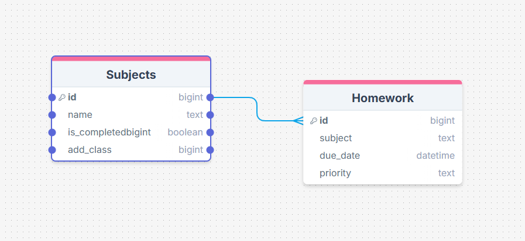

# Sprint 1 - A Working UI Prototype

## Sprint Goals

Develop a prototype that simulates the key functionality of the system, then test and refine it so that it can serve as the model for the next phase of development in Sprint 2.

[Figma](https://www.figma.com/) is used to develop the prototype.

---

## Initial Database Design

The base of how my Homework Tracker works. I will use the main page to send off in directions you want to go. For this its the base of your subjects and in each one is your work.

---

## UI 'Flow' (Homework Tracker V1)

The first stage of prototyping was to explore how the UI might 'flow' between states, based on the required functionality.

This Figma demo shows the initial design for the UI 'flow':

<iframe style="border: 1px solid rgba(0, 0, 0, 0.1);" width="800" height="450" src="https://embed.figma.com/proto/CzsUHFVExIX0iWDn6eKaub/Homework-Website-v1?node-id=1-18&starting-point-node-id=1%3A18&embed-host=share" allowfullscreen></iframe>

### Testing
I got feedback from Liam and LeBron on changes to make my website better on what they personally think.
>(Liam) Need to be able to go in and also remove the subject.

>Want to see it demonstrated as a phone screen to get a sense of where everything would be on it.

>(LeBron) Give a list of what work is in each assessment.

### Changes / Improvements

From this I changed things around to fit what they think would make my website a lot better. Adding work to each assessment and made it be seen as a phone screen. I also put as an option to remove subjects too with a screen for it. This can be seen in V2.

---

## Initial UI Prototype (Homework Tracker V2)

The next stage of prototyping was to develop the layout for each screen of the UI.

This Figma demo shows the initial layout design for the UI:

<iframe style="border: 1px solid rgba(0, 0, 0, 0.1);" width="800" height="450" src="https://embed.figma.com/proto/Vx1QhuUpbWLROC5syoiuhj/Homework-Website-v2?node-id=1-18&starting-point-node-id=1%3A18&embed-host=share" allowfullscreen></iframe>

### Testing

For this I used the feedback from V1 to make my website better. I got overall positive feedback but also some feedback on what they think can make it overall really good.
>(Liam) Colors are off and simple. Use some darker colors

>(Taine) Good idea to add Due Dates/Deadlines for each assessment that the user can customize.

>(Caius) Display priority of each assessment and subject.

### Changes / Improvements

---

## Refined UI Prototype (Homework Tracker V3)

Having established the layout of the UI screens, the prototype was refined visually, in terms of colour, fonts, etc.

This Figma demo shows the UI with refinements applied:

<iframe style="border: 1px solid rgba(0, 0, 0, 0.1);" width="800" height="450" src="https://embed.figma.com/proto/QZtY2UcOTztjzKl2aKPfGa/Homework-Website-v3?node-id=1-18&p=f&scaling=min-zoom&content-scaling=fixed&page-id=0%3A1&starting-point-node-id=1%3A18&embed-host=share" allowfullscreen></iframe>

### Testing

To do this I used all the feedback from V2 and used it to make the site a lot better for the users. I didn't finish colors 100% but had a sort of play around with what I might want to use.

>(Liam) Looks good. Just needs colors to look better an eye popping but also easy on users eyes.

### Changes / Improvements

I will change the colors to make the website look nice and not bland when it comes to doing the websites final version in the assessment.

---

## Sprint Review

This sprint has moved the project forward as I have been able to use my end-users feedback to make my website better. They've given me help to add things I wouldn't even think up to add. So thanks to their feedback and critiques it has helped build up the websites and give it a ton of good features. It also helps as it's what they would want to see in an app for their homework tracker.

