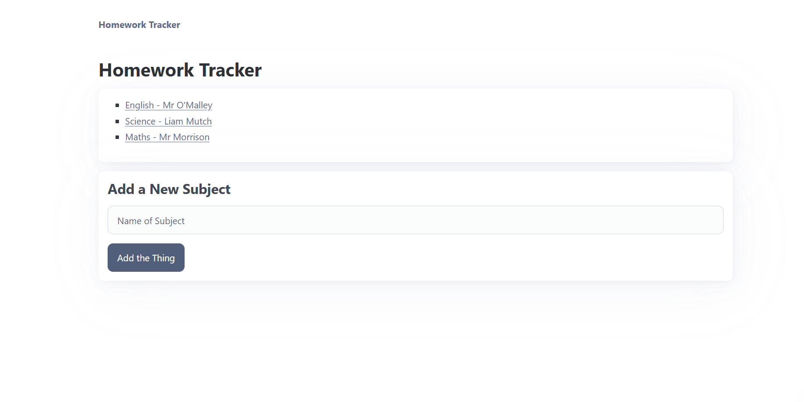
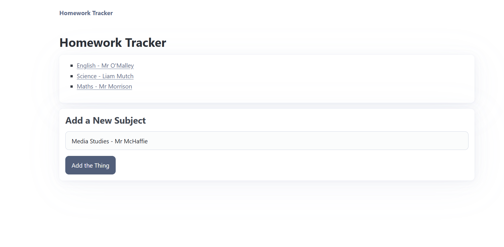
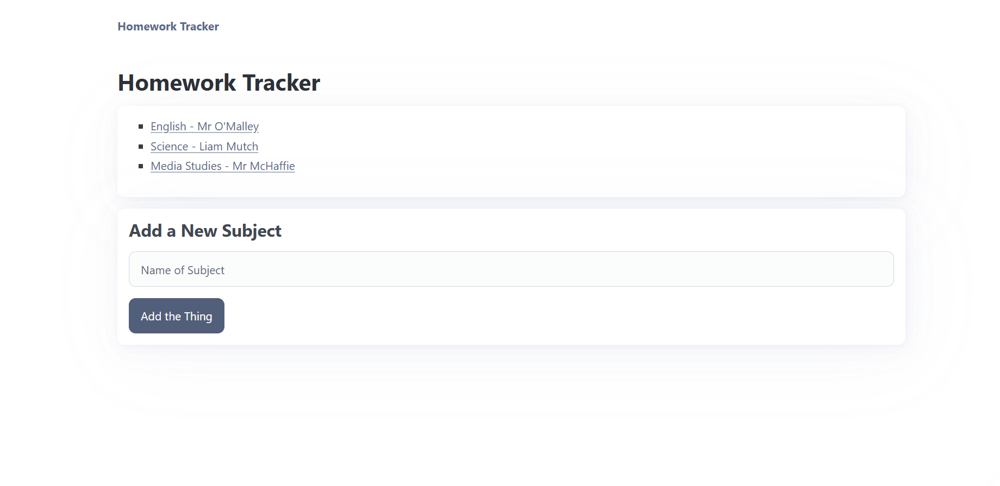
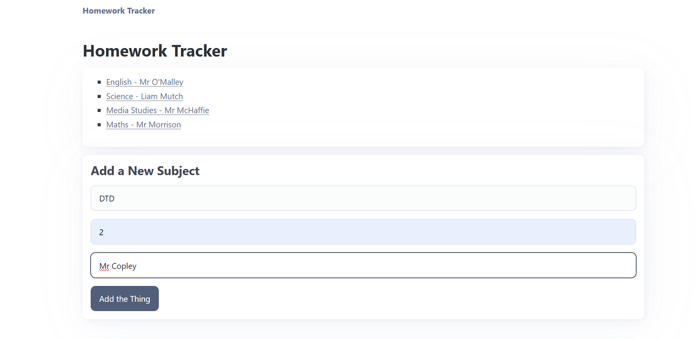
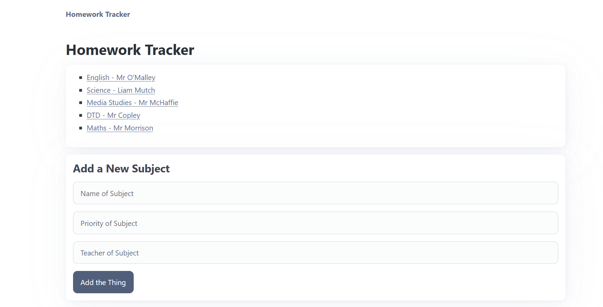
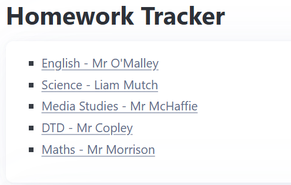
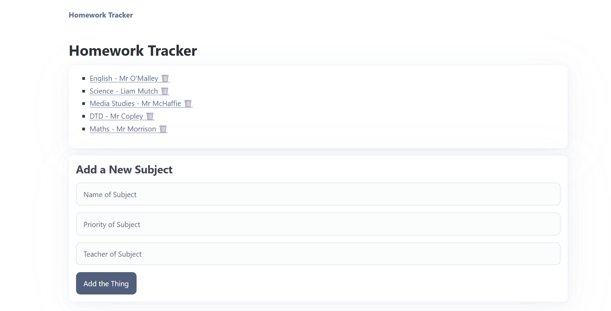
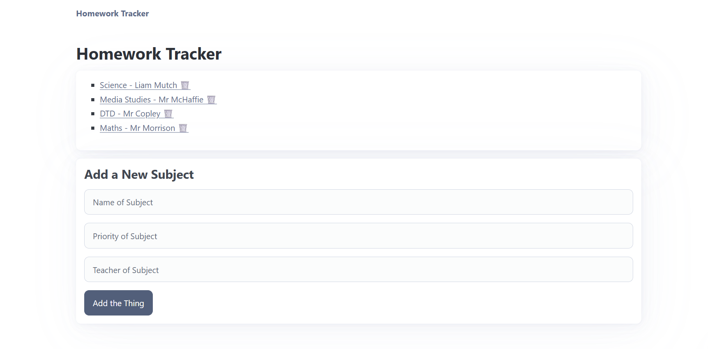

# Sprint 2 - A Minimum Viable Product (MVP)

## Sprint Goals

Develop a bare-bones, working web application that provides the key functionality of the system, then test and refine it so that it can serve as the basis for the final phase of development in Sprint 3.

---

## Implemented Database Schema

The Homework Tracker will be a website where you can create a base subject with teacher and priority of the subject to your studies. Then in each subject you can add work and assessments that you want to track to complete. Being ablew to display them by priority and add their due dates too!

---

## Initial Implementation

The key functionality of the web app was implemented:

---

## Adding Teacher and Priority

For my project I wanted the user to be able to add their teachers names for each subject and the priority of the subject to them and their studies. Currently all you can do is add subject and thats it. So I am testing adding teacher and priority and making it a part of the form process through post and hopefully it will be added with the subject when the user clicks add.

### Changes / Improvements

I now added the post method for the forms allowing the user to now add teacher names and priority for each subject. The end-user finds this really useful.

---

## Delete Functions

I am trying to get a delete function working so the user, once done with subjects, can delete their subject all together. Right now they only stack up on subjects without the option to remove them. I will add it in the home page below the adding function and add a delete trashcan to represent how they delete their subjects.

### Changes / Improvements

I have successfully added a delete function and added the message to make sure the user does in fact want to delete their subject. It comes as a trashcan form for the user to click.

---

## Testing FEATURE NAME HERE

Replace this text with notes about what you are testing, how you tested it, and the outcome of the testing

**PLACE SCREENSHOTS AND/OR ANIMATED GIFS OF THE TESTING HERE**

### Changes / Improvements

Replace this text with notes any improvements you made as a result of the testing.

**PLACE SCREENSHOTS AND/OR ANIMATED GIFS OF THE IMPROVED SYSTEM HERE**

---

## Testing FEATURE NAME HERE

Replace this text with notes about what you are testing, how you tested it, and the outcome of the testing

**PLACE SCREENSHOTS AND/OR ANIMATED GIFS OF THE TESTING HERE**

### Changes / Improvements

Replace this text with notes any improvements you made as a result of the testing.

**PLACE SCREENSHOTS AND/OR ANIMATED GIFS OF THE IMPROVED SYSTEM HERE**

---

## Testing FEATURE NAME HERE

Replace this text with notes about what you are testing, how you tested it, and the outcome of the testing

**PLACE SCREENSHOTS AND/OR ANIMATED GIFS OF THE TESTING HERE**

### Changes / Improvements

Replace this text with notes any improvements you made as a result of the testing.

**PLACE SCREENSHOTS AND/OR ANIMATED GIFS OF THE IMPROVED SYSTEM HERE**

---

## Sprint Review

Replace this text with a statement about how the sprint has moved the project forward - key success point, any things that didn't go so well, etc.

