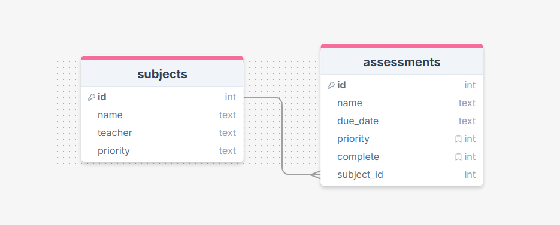

# Sprint 2 - A Minimum Viable Product (MVP)

## Sprint Goals

Develop a bare-bones, working web application that provides the key functionality of the system, then test and refine it so that it can serve as the basis for the final phase of development in Sprint 3.

---

## Implemented Database Schema

The Homework Tracker will be a website where you can create a base subject with teacher and priority of the subject to your studies. Then in each subject you can add work and assessments that you want to track to complete. Being ablew to display them by priority and add their due dates too!

---

## Initial Implementation

The key functionality of the web app was implemented:

**PLACE SCREENSHOTS AND/OR ANIMATED GIFS OF THE SYSTEM HERE**

---

## Testing FEATURE NAME HERE

Replace this text with notes about what you are testing, how you tested it, and the outcome of the testing

**PLACE SCREENSHOTS AND/OR ANIMATED GIFS OF THE TESTING HERE**

### Changes / Improvements

Replace this text with notes any improvements you made as a result of the testing.

**PLACE SCREENSHOTS AND/OR ANIMATED GIFS OF THE IMPROVED SYSTEM HERE**

---

## Testing FEATURE NAME HERE

Replace this text with notes about what you are testing, how you tested it, and the outcome of the testing

**PLACE SCREENSHOTS AND/OR ANIMATED GIFS OF THE TESTING HERE**

### Changes / Improvements

Replace this text with notes any improvements you made as a result of the testing.

**PLACE SCREENSHOTS AND/OR ANIMATED GIFS OF THE IMPROVED SYSTEM HERE**

---

## Testing FEATURE NAME HERE

Replace this text with notes about what you are testing, how you tested it, and the outcome of the testing

**PLACE SCREENSHOTS AND/OR ANIMATED GIFS OF THE TESTING HERE**

### Changes / Improvements

Replace this text with notes any improvements you made as a result of the testing.

**PLACE SCREENSHOTS AND/OR ANIMATED GIFS OF THE IMPROVED SYSTEM HERE**

---

## Testing FEATURE NAME HERE

Replace this text with notes about what you are testing, how you tested it, and the outcome of the testing

**PLACE SCREENSHOTS AND/OR ANIMATED GIFS OF THE TESTING HERE**

### Changes / Improvements

Replace this text with notes any improvements you made as a result of the testing.

**PLACE SCREENSHOTS AND/OR ANIMATED GIFS OF THE IMPROVED SYSTEM HERE**

---

## Testing FEATURE NAME HERE

Replace this text with notes about what you are testing, how you tested it, and the outcome of the testing

**PLACE SCREENSHOTS AND/OR ANIMATED GIFS OF THE TESTING HERE**

### Changes / Improvements

Replace this text with notes any improvements you made as a result of the testing.

**PLACE SCREENSHOTS AND/OR ANIMATED GIFS OF THE IMPROVED SYSTEM HERE**

---

## Sprint Review

Replace this text with a statement about how the sprint has moved the project forward - key success point, any things that didn't go so well, etc.

